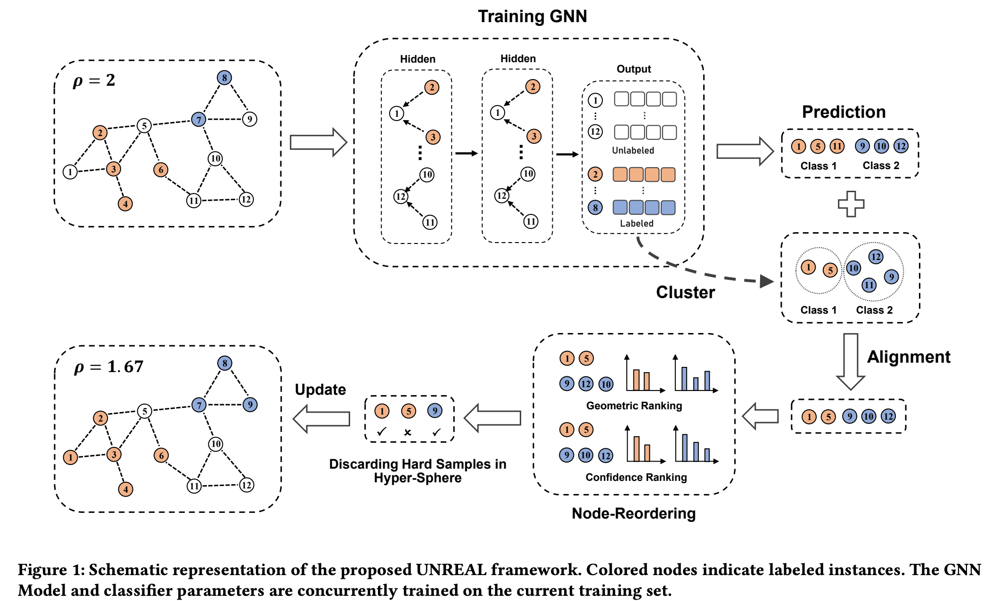

# Geometric Imbalance in Semi-Supervised Node Classification (NeurIPS 2025).

Official Pytorch implementation of"Geometric Imbalance in Semi-Supervised Node Classification" (NeurIPS 2025).

**Previous Version: UNREAL:Unlabeled Nodes Retrieval and Labeling for Heavily-imbalanced Node Classification (Arxiv 2023)**

[[Project Page](https://divinyan.com/UNREAL/)] [[Arxiv](https://arxiv.org/abs/2303.10371)] [[Paper](https://openreview.net/forum?id=BND9CutZf6&referrer=%5Bthe%20profile%20of%20Liang%20Yan%5D(%2Fprofile%3Fid%3D~Liang_Yan5))]

Authors: Liang Yan, Shengzhong Zhang, Bisheng Li, Menglin Yang, Chen Yang, Min Zhou, Weiyang Ding, Yutong Xie, Zengfeng Huang 

## Introduction


<!--  -->
Class imbalance in graph data poses a major challenge for effective node classification, particularly in semi-supervised settings. In this work, we formally introduce the concept of geometric imbalance, characterizing how class imbalance induces geometric ambiguity among minority nodes in the embedding space. We provide a rigorous theoretical analysis and propose a unified framework to explicitly mitigate geometric imbalance through pseudo-label alignment, node reordering, and ambiguity filtering. Extensive experiments on diverse benchmarks show that our approach consistently outperforms existing methods, especially under severe class imbalance. Our findings offer new theoretical insights and practical tools for robust semi-supervised imbalanced node classification. The detailed code implementation of this work is provided in the supplementary material.

## Environment
```bash
conda create -n "unreal" python=3.8.13
source activate unreal
conda install pytorch==1.12.1 torchvision==0.13.1 torchaudio==0.12.1 cudatoolkit=11.3 -c pytorch
pip install torch_geometric
pip install https://data.pyg.org/whl/torch-1.12.0%2Bcu113/pyg_lib-0.3.1%2Bpt112cu113-cp38-cp38-linux_x86_64.whl
pip install https://data.pyg.org/whl/torch-1.12.0%2Bcu113/torch_cluster-1.6.0%2Bpt112cu113-cp38-cp38-linux_x86_64.whl
pip install https://data.pyg.org/whl/torch-1.12.0%2Bcu113/torch_scatter-2.1.0%2Bpt112cu113-cp38-cp38-linux_x86_64.whl
pip install https://data.pyg.org/whl/torch-1.12.0%2Bcu113/torch_sparse-0.6.16%2Bpt112cu113-cp38-cp38-linux_x86_64.whl
pip install https://data.pyg.org/whl/torch-1.12.0%2Bcu113/torch_spline_conv-1.2.1%2Bpt112cu113-cp38-cp38-linux_x86_64.whl
```
## Training Hyperparameters
### Cora-Semi (imbalance ratio= 10, 20, 50, 100)
- Cora-GCN (imbalance ratio= 10)
  ```bash
  python main.py --dataset Cora --repetitions 5 --imb_ratio 10 --net GCN  --rounds 40 --ad 4 --rbo 0.5 --threshold 0.25
  ```
- Cora-GAT (imbalance ratio= 10)
  ```bash
  python main.py --dataset Cora --repetitions 5 --imb_ratio 10 --net GAT  --rounds 40 --ad 4 --rbo 0.5 --threshold 0.25
  ```
- Cora-SAGE (imbalance ratio= 10)
  ```bash
  python main.py --dataset Cora --repetitions 5 --imb_ratio 10 --net SAGE  --rounds 40 --ad 4 --rbo 0.5 --threshold 0.25
  ```
- Cora-GCN (imbalance ratio= 20)
  ```bash
  python main.py --dataset Cora --repetitions 5 --imb_ratio 20 --net GCN  --rounds 40 --ad 4 --rbo 0.5 --threshold 0.25
  ```
- Cora-GAT (imbalance ratio= 20)
  ```bash
  python main.py --dataset Cora --repetitions 5 --imb_ratio 20 --net GAT  --rounds 40 --ad 4 --rbo 0.5 --threshold 0.25
  ```
- Cora-SAGE (imbalance ratio= 20)
  ```bash
  python main.py --dataset Cora --repetitions 5 --imb_ratio 20 --net SAGE  --rounds 40 --ad 4 --rbo 0.5 --threshold 0.25
  ```
- Cora-GCN (imbalance ratio= 50)
  ```bash
  python main.py --dataset Cora --repetitions 5 --imb_ratio 50 --net GCN  --rounds 40 --ad 4 --rbo 0.5 --threshold 0.25
  ```
- Cora-GAT (imbalance ratio= 50)
  ```bash
  python main.py --dataset Cora --repetitions 5 --imb_ratio 50 --net GAT  --rounds 40 --ad 4 --rbo 0.5 --threshold 0.25
  ```
- Cora-SAGE (imbalance ratio= 50)
  ```bash
  python main.py --dataset Cora --repetitions 5 --imb_ratio 50 --net SAGE  --rounds 40 --ad 4 --rbo 0.5 --threshold 0.25
  ```
- Cora-GCN (imbalance ratio= 100)
  ```bash
  python main.py --dataset Cora --repetitions 5 --imb_ratio 100 --net GCN  --rounds 40 --ad 4 --rbo 0.5 --threshold 0.25
  ```
- Cora-GAT (imbalance ratio= 100)
  ```bash
  python main.py --dataset Cora --repetitions 5 --imb_ratio 100 --net GAT  --rounds 40 --ad 4 --rbo 0.5 --threshold 0.25
  ```
- Cora-SAGE (imbalance ratio= 100)
  ```bash
  python main.py --dataset Cora --repetitions 5 --imb_ratio 100 --net SAGE  --rounds 40 --ad 4 --rbo 0.5 --threshold 0.25
  ```

### CiteSeer-Semi (imbalance ratio= 10, 20, 50, 100)
- CiteSeer-GCN (imbalance ratio= 10)
  ```bash
  python main.py --dataset CiteSeer --repetitions 5 --imb_ratio 10 --net GCN  --rounds 10 --ad 5 --rbo 0.5 --threshold 0.25
  ```
- CiteSeer-GAT (imbalance ratio= 10)
  ```bash
  python main.py --dataset CiteSeer --repetitions 5 --imb_ratio 10 --net GAT  --rounds 10 --ad 5 --rbo 0.5 --threshold 0.25
  ```
- CiteSeer-SAGE (imbalance ratio= 10)
  ```bash
  python main.py --dataset CiteSeer --repetitions 5 --imb_ratio 10 --net SAGE  --rounds 10 --ad 5 --rbo 0.5 --threshold 0.25
  ```
- CiteSeer-GCN (imbalance ratio= 20)
  ```bash
  python main.py --dataset CiteSeer --repetitions 5 --imb_ratio 20 --net GCN  --rounds 10 --ad 5 --rbo 0.5 --threshold 0.25
  ```
- CiteSeer-GAT (imbalance ratio= 20)
  ```bash
  python main.py --dataset CiteSeer --repetitions 5 --imb_ratio 20 --net GAT  --rounds 10 --ad 5 --rbo 0.5 --threshold 0.25
  ```
- CiteSeer-SAGE (imbalance ratio= 20)
  ```bash
  python main.py --dataset CiteSeer --repetitions 5 --imb_ratio 20 --net SAGE  --rounds 10 --ad 5 --rbo 0.5 --threshold 0.25
  ```
- CiteSeer-GCN (imbalance ratio= 50)
  ```bash
  python main.py --dataset CiteSeer --repetitions 5 --imb_ratio 50 --net GCN  --rounds 10 --ad 5 --rbo 0.5 --threshold 0.25
  ```
- CiteSeer-GAT (imbalance ratio= 50)
  ```bash
  python main.py --dataset CiteSeer --repetitions 5 --imb_ratio 50 --net GAT  --rounds 10 --ad 5 --rbo 0.5 --threshold 0.25
  ```
- CiteSeer-SAGE (imbalance ratio= 50)
  ```bash
  python main.py --dataset CiteSeer --repetitions 5 --imb_ratio 50 --net SAGE  --rounds 10 --ad 5 --rbo 0.5 --threshold 0.25
  ```
- CiteSeer-GCN (imbalance ratio= 100)
  ```bash
  python main.py --dataset CiteSeer --repetitions 5 --imb_ratio 100 --net GCN  --rounds 10 --ad 5 --rbo 0.5 --threshold 0.25
  ```
- CiteSeer-GAT (imbalance ratio= 100)
  ```bash
  python main.py --dataset CiteSeer --repetitions 5 --imb_ratio 100 --net GAT  --rounds 10 --ad 5 --rbo 0.5 --threshold 0.25
  ```
- CiteSeer-SAGE (imbalance ratio= 100)
  ```bash
  python main.py --dataset CiteSeer --repetitions 5 --imb_ratio 100 --net SAGE  --rounds 10 --ad 5 --rbo 0.5 --threshold 0.25
  ```

### PubMed-Semi (imbalance ratio= 10, 20, 50, 100)
- PubMed-GCN (imbalance ratio= 10)
  ```bash
  python main.py --dataset  PubMed --repetitions 5 --imb_ratio 10 --net GCN  --rounds 40 --ad 4 --rbo 0.5 --threshold 0.25
  ```
- PubMed-GAT (imbalance ratio= 10)
  ```bash
  python main.py --dataset  PubMed --repetitions 5 --imb_ratio 10 --net GAT  --rounds 40 --ad 4 --rbo 0.5 --threshold 0.25
  ```
- PubMed-SAGE (imbalance ratio= 10)
  ```bash
  python main.py --dataset  PubMed --repetitions 5 --imb_ratio 10 --net SAGE  --rounds 40 --ad 4 --rbo 0.5 --threshold 0.25
  ```
- PubMed-GCN (imbalance ratio= 20)
  ```bash
  python main.py --dataset  PubMed --repetitions 5 --imb_ratio 20 --net GCN  --rounds 40 --ad 4 --rbo 0.5 --threshold 0.25
  ```
- PubMed-GAT (imbalance ratio= 20)
  ```bash
  python main.py --dataset  PubMed --repetitions 5 --imb_ratio 20 --net GAT  --rounds 40 --ad 4 --rbo 0.5 --threshold 0.25
  ```
- PubMed-SAGE (imbalance ratio= 20)
  ```bash
  python main.py --dataset  PubMed --repetitions 5 --imb_ratio 20 --net SAGE  --rounds 40 --ad 4 --rbo 0.5 --threshold 0.25
  ```
- PubMed-GCN (imbalance ratio= 50)
  ```bash
  python main.py --dataset  PubMed --repetitions 5 --imb_ratio 50 --net GCN  --rounds 40 --ad 4 --rbo 0.5 --threshold 0.25
  ```
- PubMed-GAT (imbalance ratio= 50)
  ```bash
  python main.py --dataset  PubMed --repetitions 5 --imb_ratio 50 --net GAT  --rounds 40 --ad 4 --rbo 0.5 --threshold 0.25
  ```
- PubMed-SAGE (imbalance ratio= 50)
  ```bash
  python main.py --dataset  PubMed --repetitions 5 --imb_ratio 50 --net SAGE  --rounds 40 --ad 4 --rbo 0.5 --threshold 0.25
  ```
- PubMed-GCN (imbalance ratio= 100)
  ```bash
  python main.py --dataset  PubMed --repetitions 5 --imb_ratio 100 --net GCN  --rounds 40 --ad 4 --rbo 0.5 --threshold 0.25
  ```
- PubMed-GAT (imbalance ratio= 100)
  ```bash
  python main.py --dataset  PubMed --repetitions 5 --imb_ratio 100 --net GAT  --rounds 40 --ad 4 --rbo 0.5 --threshold 0.25
  ```
- PubMed-SAGE (imbalance ratio= 100)
  ```bash
  python main.py --dataset  PubMed --repetitions 5 --imb_ratio 100 --net SAGE  --rounds 40 --ad 4 --rbo 0.5 --threshold 0.25
  ```


## Baselines
### The Implementation of Baselines and the Configuration of Hyperparameters
- For the implementation and hyperparameters setting of **Re-Weight, PC Softmax, BalancedSoftmax, TAM**, please refer to [TAM](https://github.com/Jaeyun-Song/TAM).
- For the implementation and hyperparameters setting of **GraphSmote**, please refer to [GraphSmote](https://github.com/TianxiangZhao/GraphSmote).
- For the implementation and hyperparameters setting of **Renode**, please refer to [Renode](https://github.com/victorchen96/ReNode).
- For the implementation and hyperparameters setting of **GraphENS**, please refer to [GraphENS](https://github.com/JoonHyung-Park/GraphENS).

We strictly adhere to the hyperparameter settings as specified in these papers. For detailed information, please refer to the respective publications.


## Configuration
All the algorithms and models are implemented in Python and PyTorch Geometric. Experiments are conducted on a server with an NVIDIA 3090 GPU (24 GB memory) and an Intel(R) Xeon(R) Silver 4210R CPU @ 2.40GHz.


## Cite Us
Feel free to cite this work if you find it useful to you!
```bash
@inproceedings{yan2025geometric,
      title={Geometric Imbalance in Semi-Supervised Imbalanced Node Classification},
      author={Yan, Liang and Zhang, Shengzhong and Li, Bisheng and Yang, Mengling and Yang, Chen, and Zhou, Min and Ding, Weiyang and Xie, Yutong and Huang, Zengfeng},
      booktitle={The Thirty-ninth Annual Conference on Neural Information Processing Systems},
      year={2025},
      url={https://openreview.net/forum?id=BND9CutZf6}
      }
```
