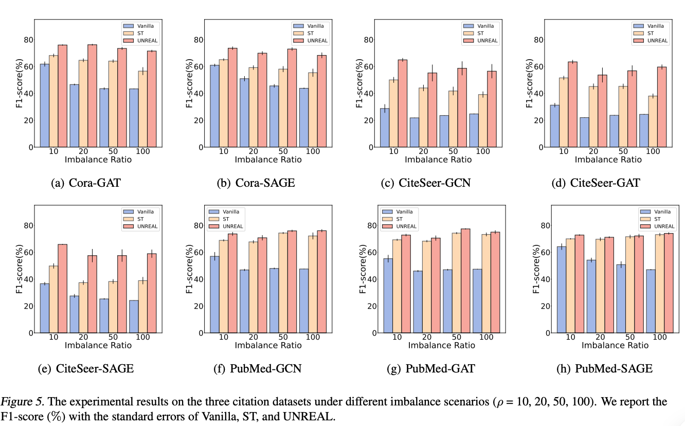

# UNREAL: Unlabeled Nodes Retrieval and Labeling for Heavily-imbalanced Node Classification.(Arxiv 2023)

## Introduction

Official Pytorch implementation of arxiv 2023 paper "[UNREAL:Unlabeled Nodes Retrieval and Labeling for Heavily-imbalanced Node Classification](https://arxiv.org/abs/2303.10371)"



Extremely skewed label distributions are common in real-world node classification tasks. If not dealt with appropriately, it significantly hurts the performance of GNNs in minority classes. Due to its practical importance, there have been a series of recent research devoted to this challenge. Existing over-sampling techniques smooth the label distribution by generating ``fake'' minority nodes and synthesizing their features and local topology, which largely ignore the rich information of unlabeled nodes on graphs. In this paper, we propose UNREAL, an iterative over-sampling method. The first key difference is that we only add unlabeled nodes instead of synthetic nodes, which eliminates the challenge of feature and neighborhood generation. To select which unlabeled nodes to add, we propose geometric ranking to rank unlabeled nodes. Geometric ranking exploits unsupervised learning in the node embedding space to effectively calibrates pseudo-label assignment. Finally, we identify the issue of geometric imbalance in the embedding space and provide a simple metric to filter out geometrically imbalanced nodes. Extensive experiments on real-world benchmark datasets are conducted, and the empirical results show that our method significantly outperforms current state-of-the-art methods consistent on different datasets with different imbalance ratios.


## Configuration
All the algorithms and models are implemented in Python and PyTorch Geometric. Experiments are
conducted on a server with an NVIDIA 3090 GPU (24 GB memory) and an Intel(R) Xeon(R) Silver
4210R CPU @ 2.40GHz.

## Citation
```
@misc{yan2023unrealunlabeled,
      title={UNREAL:Unlabeled Nodes Retrieval and Labeling for Heavily-imbalanced Node Classification}, 
      author={Liang Yan and Shengzhong Zhang and Bisheng Li and Min Zhou and Zengfeng Huang},
      year={2023},
      eprint={2303.10371},
      archivePrefix={arXiv},
      primaryClass={cs.LG}
}
```
